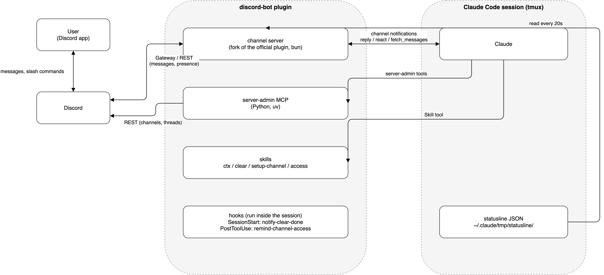

# Claude Code 用 Discord Bot プラグイン（discord-bot）

*An unofficial Claude Code plugin for using a Claude Code session from Discord. It adds context usage, session clearing, bot status, server management, and custom slash commands to the official Discord channel plugin. Documentation is in Japanese.*

自分の Discord サーバーで動かしている管理 Bot「kuroko-chan」の中身を、Claude Code プラグインとして公開したものです。
Discord 社および Anthropic 社とは無関係の、非公式なコミュニティ製プラグインです。

Claude Code の Discord チャンネル機能（`claude --channels ...`）を使うと、Discord のメッセージを Claude の会話に流し込めます。
公式プラグインが担当するのはメッセージの送受信までで、コンテキスト残量の確認・クリアや、チャンネル・スレッドの操作には
対応していません。そこで公式の channel サーバーをフォークし、自分が欲しかったセッション管理、サーバー管理、
Bot ステータス表示を追加しました。
作った経緯と考え方は [docs/background.md](docs/background.md) にあります。

## 全体像



## 機能

| 機能 | 使い方 |
| --- | --- |
| Discord との送受信 | 公式プラグインからフォークした channel サーバー `channel/`<br>`reply`・`react`・`edit_message`・`fetch_messages`・`download_attachment` |
| アクセス管理 | `/discord-bot:access` でペアリング承認・allowlist・受信チャンネルを設定<br>`/discord-bot:configure` で Bot トークンを保存<br>設定先は公式と同じ `~/.claude/channels/discord/` |
| コンテキスト使用量の表示 | Discord で `/ctx`<br>ctx・5h・7d の使用率をコードブロックで返信 |
| Discord からのクリア | Discord で `/clear`<br>実行前の通知 → tmux ペインへ `/clear` を送信 → 新セッション開始時に完了を自動投稿 |
| Bot ステータスに使用量を常時表示 | Bot のアクティビティを `ctx 53% · 5h 46% · 7d 17%` に更新<br>ctx 80% 以上は赤<br>セッションなしは黄 |
| サーバー管理 MCP | チャンネル・カテゴリ・フォーラムスレッドの作成・編集・削除・一覧<br>`server-admin` 全 9 ツール |
| チャンネル作成ワークフロー | `/discord-bot:setup-channel`<br>作成 → `access.json` の受信設定 → 受信テスト<br>作成直後はフックが受信設定を案内 |
| スラッシュコマンド | `/ctx` と `/clear` を同梱<br>`~/.claude/discord-bot/commands.json` で任意のスキルを引数付きコマンドとして追加 |
| 起動ランチャー | `scripts/start-discord.sh` で tmux セッション `discord` に Claude Code を起動<br>二重起動を防止 |

## セットアップ

必要なものは tmux、uv、bun、Discord Bot です。Bot は Message Content Intent を有効にし、`bot` と `applications.commands` の
2 つのスコープでサーバーに招待してください。`applications.commands` が無いと、スラッシュコマンドを登録できません。
Bot の作り方は `channel/UPSTREAM-README.md` の Quick Setup 1〜3 と同じです。動作確認は macOS で行っています。

1. Discord セッションを動かすプロジェクトで、このプラグインをプロジェクトスコープで有効にします。
   公式の Discord プラグインを使っていた場合は、先に無効にしてください。同じトークンで 2 本接続すると、返信が二重になります。

```sh
claude plugin marketplace add ryuki-imachi/claude-code-discord-bot
cd <Discord セッションに使うプロジェクト>
claude plugin install discord-bot@ryuki-plugins --scope project
```

2. Bot トークンを保存します。公式プラグインで設定済みなら、そのまま使えます。
   Bot が 1 つのサーバーにしか入っていない場合、ギルド ID は省略できます。

```
/discord-bot:configure <トークン>
```

3. ステータスラインの出力を JSON で保存します。`/ctx` と Bot ステータス表示は、この JSON を読みます。
   `settings.json` の `statusLine.command` から、次のようにラッパーを呼び出してください。

```json
{
  "statusLine": {
    "type": "command",
    "command": "uv run ~/path/to/claude-code-discord-bot/scripts/statusline_dump.py -- <元のコマンド>"
  }
}
```

4. このプラグインを Discord との送受信（channel）に使う場合は、Claude Code の承認リストに追加します。
   追加しないと、公式以外の channel プラグインから届いた通知が破棄されます。macOS では、管理者設定の
   `/Library/Application Support/ClaudeCode/managed-settings.json` に sudo で次の内容を書きます。

```json
{
  "allowedChannelPlugins": [
    { "plugin": "discord-bot", "marketplace": "ryuki-plugins" },
    { "plugin": "discord", "marketplace": "claude-plugins-official" }
  ]
}
```

   管理者設定を変更しない場合は、`DISCORD_BOT_CHANNEL_MODE=official` を付けて起動してください。公式プラグインが channel を担当し、
   このプラグインは Bot ステータス表示・サーバー管理 MCP・スキルだけを担当します。この構成ではスラッシュコマンドを使えません。

5. プロジェクトのディレクトリで起動します。tmux セッション `discord` の中で Claude Code が動きます。初回は DM のペアリングコードを
   `/discord-bot:access pair <コード>` で承認してください。

```sh
~/path/to/claude-code-discord-bot/scripts/start-discord.sh                       # 新規
~/path/to/claude-code-discord-bot/scripts/start-discord.sh --resume <session-id> # 会話を引き継ぐ
```

起動画面の上のほうに「messages from plugin:discord-bot@ryuki-plugins inject directly in this session」と出て、
その下に「not on the approved channels allowlist」の行が無ければ、Discord からのメッセージが届く状態です。

## 使い方

Discord のチャンネルで `/ctx` と送ると、次のような返事が来ます。

```
コンテキスト使用量
ctx ■■■■■□□□□□ 54%  544.8K / 1000.0K tokens
5h  ■■■■■□□□□□ 48%  リセット 09/03 00:00
7d  ■□□□□□□□□□ 13%  リセット 09/06 19:00
セッション 1c5a207c  Fable 5.1  計測 09/02 23:00:54  source statusline
```

`/clear` と送ると「クリアするね（今 54%）」と返事があり、数秒後に「コンテキストをクリアしたよ」が届きます。
その次のメッセージから新しいセッションになります。作業途中の要点は、クリア前に台帳などへ書いておいてください。

Bot のステータスは、Claude が応答するたびに更新されます。channel サーバーがステータスラインの値を最大 20 秒ごとに拾うため、
何もしていない間は変わりません。カード 2 行目の「更新 HH:MM」は、ステータスラインが最後に再描画された時刻です。

チャンネルを増やしたいときは Discord で「〇〇というチャンネル作って」と頼めば `/discord-bot:setup-channel` が
作成から受信設定、受信テストまで案内します。

## ドキュメント

- [docs/background.md](docs/background.md) 背景と考え方、関連記事
- [docs/how-it-works.md](docs/how-it-works.md) /clear の流れ、Bot ステータス、スラッシュコマンド、サーバー管理 MCP、制約
- [docs/development.md](docs/development.md) 更新のしかた、ディレクトリ構成、移植の経緯

## ライセンス

このリポジトリは MIT License です。ただし `channel/` は公式 Discord プラグイン
（`anthropics/claude-plugins-official`、Apache-2.0）のフォークなので、そのディレクトリのファイルは
Apache-2.0 のままです（`channel/LICENSE`）。改変した内容は `channel/server.ts` の先頭に書いてあります。
