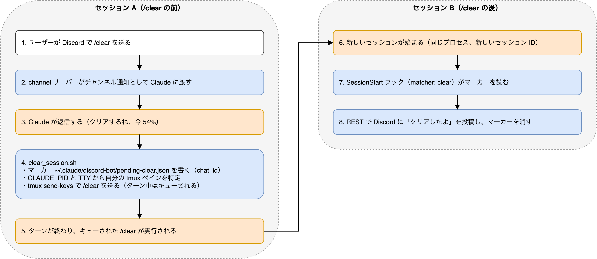
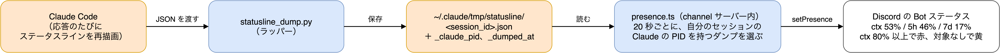
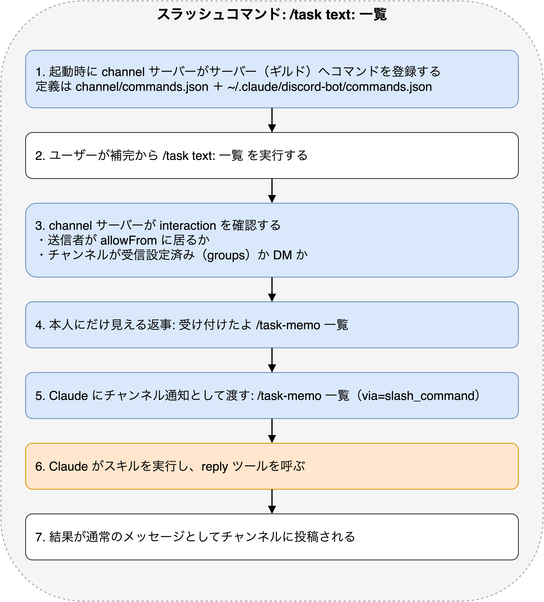

# 仕組み

## /clear の流れ



- `/clear` はターン実行中でもキューされ、ターン終了直後に実行されます。プロセスと MCP 接続は残り、セッション ID だけ変わります
- 手動でターミナルから `/clear` した場合はマーカーが無いので通知しません。10 分より古いマーカーも無視します
- 送り先の特定は `CLAUDE_PID` → その TTY → 同じ TTY を持つ tmux ペイン、の順です。tmux の外では NG を返します

## Bot ステータス



`channel/presence.ts` が、channel サーバーを起動した Claude Code 本体の PID を親プロセスをたどって特定し、
その PID を `_claude_pid` に持つステータスラインのダンプを 20 秒ごとに読んでアクティビティを更新します
（見つからなければ、生きているセッションの最新のダンプを使います）。ctx 80% 以上で取り込み中（赤）、
対象が無ければ退席中（黄）です。
Bot が送れるアクティビティのフィールドは name / type / state / url だけです。`DISCORD_PRESENCE_MODE` で
playing（既定）/ watching / listening / competing / custom を選べます（custom は吹き出し表示で狭い）。

## スラッシュコマンド



channel サーバーは起動時に、Bot が参加している各サーバーへスラッシュコマンドを登録します（ギルドコマンドなので即時反映）。
定義は `channel/commands.json`（同梱: `/ctx`、`/clear`、`/model`、`/effort`）と、`~/.claude/discord-bot/commands.json`（追加分）を合わせたものです。
ワークスペース固有のコマンドは追加分のファイルに書きます。同名なら追加分が勝ちます。

```js
[
  {
    "name": "task",
    "description": "タスク台帳を操作する",
    "skill": "/task-memo",
    "options": [
      { "name": "text", "description": "操作と内容（例: 追加 明日〇〇する）", "required": true }
    ]
  }
]
```

コマンドを受けると、送信者が allowlist に居ることと送信先が受信設定済みのチャンネル（または DM）であることを確認し、
3 秒以内に「受け付けたよ」を本人にだけ見える形で返してから、`<skill> <引数...>` の 1 行を Claude に渡します
（例: `/discord-bot:ctx`、`/task-memo 追加 明日〇〇する`）。Claude はそれをスキル呼び出しとして実行し、結果を
通常のメッセージとしてチャンネルに投稿します。登録には Bot の招待時に `applications.commands` スコープが必要で、
無い場合は起動ログに再認可用の URL が出ます。`DISCORD_SLASH_COMMANDS=off` で登録を止められます。

### サーバー側で処理するコマンド（action）

定義に `skill` ではなく `action` を書いたコマンドは、Claude に渡さず channel サーバー自身が処理します
（`channel/session-control.ts`）。Claude のターンを使わないので、Claude が長い作業の途中でも即座に効きます。
`action` は同梱の `model` と `effort` だけで、追加分の `commands.json` からも同名で上書きできます。

```js
[
  {
    "name": "effort",
    "description": "Claude の思考の深さ（effort）を切り替える",
    "action": "effort",
    "options": [
      { "name": "level", "description": "low / medium / high / xhigh / max / auto", "required": true }
    ]
  }
]
```

### /model と /effort の流れ

`/clear` と同じ「claude の PID → その TTY → 同じ TTY を持つ tmux ペイン」でペインを特定し、そこへ
`/model <alias>` や `/effort <level>` を打ち込みます。違うのは、送るのが Claude ではなく channel サーバーだという点です。

1. 引数を検証します。model は `best` `fable` `opus` `sonnet` `haiku` `sonnet[1m]` `opus[1m]` `opusplan` か
   `claude-` で始まる完全なモデル ID、effort は `low` `medium` `high` `xhigh` `max` `auto` です。
   無効な値は何も送らず、依頼した本人にだけ見える形で理由と有効な一覧を返します
2. ペインを特定できなければ、同じく本人にだけ見える形で NG を返します（tmux の外では送れません）
3. ステータスラインのダンプから現在値を控えてから送信し、「/model sonnet を送ったよ（今は Fable 5.1 / effort high）。
   次のメッセージから切り替わるよ」と返します。スラッシュコマンドはターン実行中でもキューされ、ターン終了直後に実行されます
4. 送信後は 2 秒おきに最大 90 秒ダンプを読み直し、送信時刻より新しい更新で `model.id` / `model.display_name` /
   `effort.level` が変わったら「モデルを Sonnet 5 に切り替えたよ（effort high）」を依頼元のチャンネルへ投稿します。
   検知できないままタイムアウトしたときは何も投稿せず、標準エラーにログを残すだけです（検知できなくても切り替わりは効いています）

- `/model <alias>` の引数指定は「切り替えてデフォルトとして保存」する挙動（ピッカーの Enter 相当）です。
  セッション限定にする指定方法が無いため、ターミナルで新しく開くセッションのデフォルトモデルも変わります
- `effort` の `low`〜`xhigh` はモデルごとに保存され、`max` はセッション限り、`auto` は保存済みの設定をクリアします

## サーバー管理 MCP

`mcp/server-admin/` は Python（FastMCP + httpx）の MCP サーバーで、Discord REST API v10 を直接呼びます。
ツールは list_channels / create_channel / create_category / edit_channel / delete_channel /
create_forum_thread / list_threads / close_thread / reopen_thread の 9 つです。
Claude から見たツール名は `mcp__plugin_discord-bot_server-admin__<tool>` になります。
`create_channel` の直後には `hooks/remind-channel-access.py` が「access.json に受信設定を入れる」ことを促す注意書きを注入します。
`requireMention` が `true` のままだとメンション無しの投稿が届かない、という公式プラグインの落とし穴を塞ぐためです。

## 制約と注意

- Discord セッションは tmux の中で動かす前提です。tmux の外やリモート（SDK）セッションでは `/clear` `/model` `/effort` を送れず、その旨を Discord に返します
- `--channels` 付きの claude を 2 つ立てると Discord に二重返信します。ランチャーは検出して止めますが、手で起動するときは注意してください
- Bot のステータスをプログラムから読み取るには Developer Portal で Presence Intent を有効にする必要があります（設定するだけなら不要）。`scripts/discord_presence_check.py` は確認用です
- `/compact` は対象外です。同じ仕組みで送れますが、要約中に Discord 側が無音になるので用意していません

## channel プラグインの承認リスト

Claude Code は `--channels` に渡された channel プラグインを承認リスト（Anthropic 側の設定 `tengu_harbor_ledger`、
`{plugin, marketplace}` の配列）と突き合わせ、載っていなければ「not on the approved channels allowlist」として
通知を捨てます。公式の `discord@claude-plugins-official` は載っていますが、フォークしたこのプラグインは載っていません。

回避策は 2 つあります。

- 管理者設定 `allowedChannelPlugins` に同じ形式で書く（README のセットアップ 4）。管理者設定が承認リストの代わりになります
- `--dangerously-load-development-channels plugin:discord-bot@ryuki-plugins` を付けて起動する。起動時に
  「WARNING: Loading development channels」の確認が出て、承認すると読み込まれます。ただし 2026-09-03 の検証では
  この環境（Claude Max、macOS、tmux）で確認ダイアログが出ずフラグが無視されました。同じ症状が
  anthropics/claude-code#82939 で報告されています。
  `--channels` と両方に同じプラグインを渡すと `--channels` 側で判定されて弾かれるので、付けるなら開発フラグだけにします
